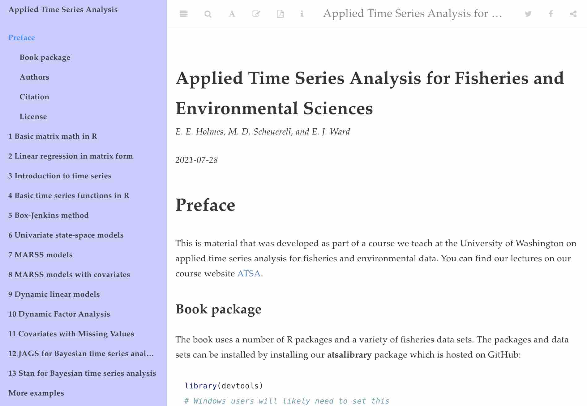

The MARSS R package: <https://cran.r-project.org/package=MARSS> is part
of the [Applied Time Series Analysis](https://atsa-es.github.io/) for
Environmental Science suite of software and educational material for
time series analysis. See the GitHub repository for the [MARSS source
code](https://github.com/atsa-es/MARSS). For fast fitting to large datasets or DFA models, see our companion package, [marssTMB](https://atsa-es.github.io/marssTMB/). 
 
 

# Documentation

*   [MARSS pkgdown site](https://atsa-es.github.io/MARSS/).

# Tutorials

*   [Quick Start Guide](https://atsa-es.github.io/MARSS/articles/Quick_Start.html).
*   [ATSA course website](https://atsa-es.github.io/atsa/) - We have
    lectures and all material from our course on our course website.
    Select the Lectures tab to find the lecture material and videos of
    lectures.
*   [ATSA lab book](https://atsa-es.github.io/atsa-labs/) - Many
    applications are also covered in our Applied Time Series Analysis
    book developed from the labs in our course.
*   [2021 ATSA Lectures on
    YouTube](https://www.youtube.com/playlist?list=PLA5yNsxyt7sC3B4qhj_sMgGWqWWaSerq-)
*   The [User Guide on
    CRAN](https://CRAN.R-project.org/package=MARSS/vignettes/UserGuide.pdf) included in the package has many examples of how to fit MARSS models to a variety of data sets.
    
## For Statisticians

For those who work on MARSS models. A good place to start might be the chapter at the end of the User Guide on the comparison of KFAS and MARSS outputs and terminology. Comparing the terminology between the two packages should help understanding the MARSS output. Similarly the chapter on StructTS will help understand the difference in notation and terminology.

MARSS is designed to provide access to every possible conditional expectation of $\mathbf{X}$ and $\mathbf{Y}$. "Every possible" means all the temporal conditionings (time 1 to $t-1$, $t$ or $T$) and all the possible standardizations (none, marginal, Cholesky). It will return the standard errors for all of these combinations. The Residuals subsection in the KFAS chapter will compare the residual options in KFAS to the MARSS residuals. The KFAS terminology may be more familiar and a table in that chapter shows you what terminology is associated with what conditional expectation. Note, KFAS and MARSS give the same values. The difference is notation and terminology. 

The EM Derivation paper goes into the nitty-gritty of the underlying EM algorithm. The Residuals paper goes through the Residuals algorithms. All the help files for the functions that implement algorithms have the details for statisticians/developers. My notes on computing the Fisher Information matrix for MARSS are in a series of notes: [Notes on computing the Fisher Information matrix for MARSS models I-IV](https://eeholmes.github.io/posts/2016-5-18-FI-recursion-1/).

# CITATION

If you use MARSS results in publications, please cite the primary
citation:

Holmes, E. E., Ward, E. J. and Wills, K. (2012) MARSS: Multivariate
Autoregressive State-space Models for Analyzing Time-series Data. The R
Journal. 4(1):11-19

You can also cite the package and user guide:

Elizabeth E. Holmes, Eric J. Ward, Mark D. Scheuerell and Kellie Wills
(2023). MARSS: Multivariate Autoregressive State-Space Modeling. R
package version 3.11.7.

Holmes, E. E., M. D. Scheuerell, and E. J. Ward (", year,") Analysis of
multivariate time-series using the MARSS package. Version ",
meta\$Version,". NOAA Fisheries, Northwest Fisheries Science Center,
2725 Montlake Blvd E., Seattle, WA 98112, DOI: 10.5281/zenodo.5781847

Type `citation("MARSS")` at the command line to get the most up to data
citations.

### PUBLICATIONS {#pubs}

To see our publications using MARSS models, see the [Applied Time Series
Analysis website](https://atsa-es.github.io/).

### NOAA Disclaimer

The MARSS R package is a scientific product and is not official
communication of the National Oceanic and Atmospheric Administration, or
the United States Department of Commerce. All NOAA code is provided on
an 'as is' basis and the user assumes responsibility for its use. Any
claims against the Department of Commerce or Department of Commerce
bureaus stemming from the use of this GitHub project will be governed by
all applicable Federal law. Any reference to specific commercial
products, processes, or services by service mark, trademark,
manufacturer, or otherwise, does not constitute or imply their
endorsement, recommendation or favoring by the Department of Commerce.
The Department of Commerce seal and logo, or the seal and logo of a DOC
bureau, shall not be used in any manner to imply endorsement of any
commercial product or activity by DOC or the United States Government.
